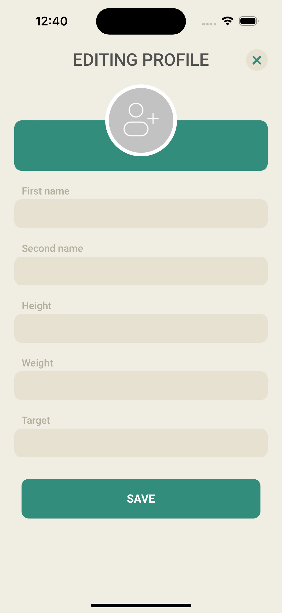

# RandomStuff

## [Animal Gallery](https://github.com/DariiaV/RandomStuff/tree/main/EmmanuelOkwara/Animal%20Gallery)
### What used:
- Tap Gesture Recognizer
- Swipe Gesture Recognizer
- Pan Gesture Recognizer

## [TicTacToe](https://github.com/DariiaV/RandomStuff/tree/main/EmmanuelOkwara/TicTacToe)
The classic Tic-Tac-Toe game (also called Noughts and Crosses)

## [TrainingApp](https://github.com/DariiaV/RandomStuff/tree/main/TrainingApp)
Application for monitoring workouts for a single user. Implemented notifications, timer. Realm was used for saving

|   |  |  |
| --------------------------------------- | --------------------------------------- | --------------------------------------- |
|  |   |  |
|   |  |  |
| --------------------------------------- | --------------------------------------- | --------------------------------------- |
|  |   |  |

